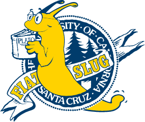

#  SlugRoute

**SlugRoute** is a comprehensive campus mapping tool for UC Santa Cruz. It helps students visualize their class schedules by scraping PISA (Schedule of Classes) data and projecting lecture, lab, and discussion locations onto an interactive Google Map with smart routing capabilities.


---

## ✨ Features

- **Automated Sync:** GitHub Actions trigger `scraper.py` every 24 hours to keep course data fresh.
- **Smart Mapping:** Distinguishes between Lectures (★), Labs (■), and Discussions (▲) using custom brand markers.
- **Multi-Stop Routing:** Calculate complex walking paths between multiple buildings with real-time distance and time estimates.
- **Point-to-Point (P2P) Mode:** Route specifically between two class markers to plan transitions between back-to-back lectures.
- **Schedule Builder:** A checkbox-based search preview allows students to select and map only specific sections.
- **Calendar Sync:** Export your combined mapped and saved schedule directly to an iCalendar (.ics) file.
- **Dark Mode:** Native support for both light and dark campus map themes with persistent state.

---

## 🛠️ Tech Stack

- **Frontend:** Vanilla JS (ES6+), CSS3 (Cascading Style Sheets), Google Maps JavaScript SDK.
- **Backend:** Go (Gin Gonic), SQLite3, HTML Template Injection.
- **Data:** Python (BeautifulSoup4) for scraping; Custom Geodata for campus buildings.

---

## 🚀 Quick Start

### 1. Prerequisites
- [Go](https://go.dev/) (1.20+)
- [Python](https://www.python.org/) (3.8+)
- A **Google Maps API Key** with **Maps JavaScript API**, **Routes API**, and **Geometry API** enabled.

### 2. Environment Configuration
Set your API key as an environment variable:
```bash
# macOS/Linux
export GOOGLE_MAPS_API_KEY="YOUR_KEY_HERE"

# Windows (PowerShell)
$env:GOOGLE_MAPS_API_KEY="YOUR_KEY_HERE"
```

### 3. Data Initialization
```bash
# Install scraper dependencies
pip install requests bs4

# Scrape current/upcoming terms
cd scraper && python scraper.py && cd ..

# Import building coordinates
cd database && python import_coords.py && cd ..
```

### 4. Run the Server
```bash
cd backend
export CGO_ENABLED=1 # Required for SQLite
go build -o slugroute
./slugroute
```
The app will be live at **`http://localhost:8080`**.

---

## 🧪 Testing & Documentation

We maintain a suite of unit tests across the stack to ensure data integrity and API reliability.

### The Quick Way (Unified)
```bash
chmod +x test_all.sh
./test_all.sh
```

### API Reference
Detailed documentation of every internal function, endpoint, and logic block can be found in [docs/api.md](./docs/api.md).

### The Manual Way
- **Backend (Go):** `cd backend && go test ./...`
- **Scraper (Python):** `python3 scraper/test_scraper.py`
- **Database Logic (Python):** `python3 database/test_import_coords.py`
- **Frontend (JS):** Open `localhost:8080/tests` in your browser with the server running.

---

## 📁 Project Structure

- `.github/workflows/` - Automated daily PISA data synchronization configs.
- `backend/` - Go Gin server, API proxy logic, and template injection.
- `database/` - SQLite storage and building coordinate mapping utilities.
- `docs/` - Architecture, [API Reference](./docs/api.md), and [Style Guides](./docs/) for Go, JS, Python, HTML, and CSS.
- `frontend/` - UI, Map logic, style sheets, and local asset storage.
- `scraper/` - Python engine for UCSC PISA data extraction.
- `screenshots/` - Visual previews, feature walkthroughs, and UI assets.

---

## 🤝 Contributing
Please refer to the language-specific **Style Guides** in the `docs` folder before submitting a Pull Request.
